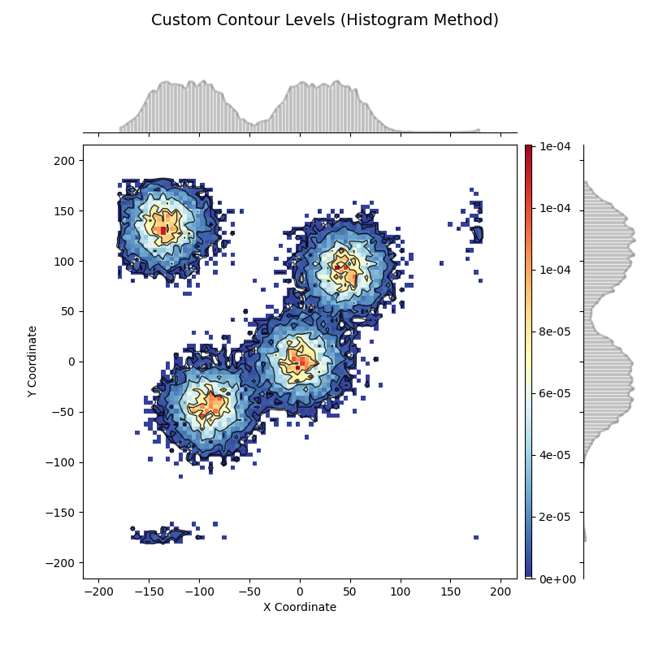
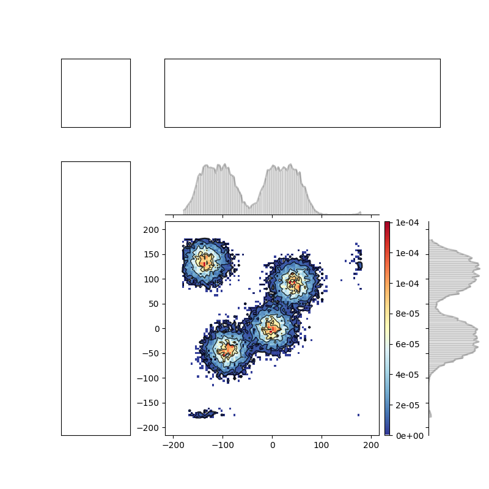

# EnsembleCompare
A package for analyzing conformational ensemble of protein systems.

Features:
1. automate general analysis on protein conformational ensembles.
2. plot functions for visualization

# Dependencies and installation
1. psfgen: `conda install conda-forge::psfgen`

**Installation**

```python
pip install .
```

For developer:
```python
pip install -e .
```

# Ensemble analysis examples
To be continued!

# Plot samples



