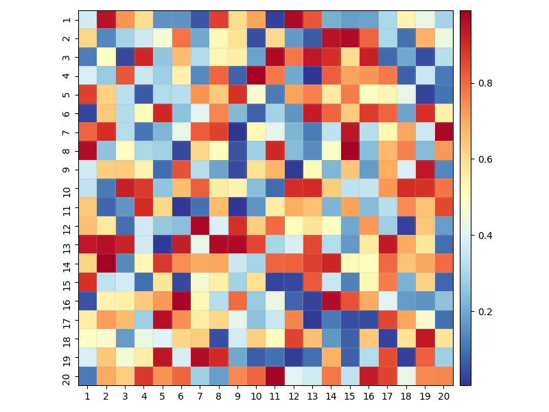

# EnsembleAnalysis

A package for analyzing conformational ensemble of protein systems.

Features:

1. automate general analysis on protein conformational ensembles.
2. plot functions for visualization

# Dependencies and installation

1. psfgen: `conda install conda-forge::psfgen`

**Installation**

Download this repository and `cd` to the directory storing the `pyproject.toml` file.

For release:

```python
pip install .
```

For developer:

```python
pip install -e .
```

# Ensemble analysis examples

To be continued!

# Plot samples

## Simple plots

```python
from EnsembleAnalysis.utils.plot import *

# generate synthetic data
line_data = generate_line_plot_data()
hist_data = generate_histogram_data()

# make plot
fig, axs = plt.subplots(1,2, figsize=(8,4))
# plot lines
line_plot(line_data['sine_wave'][0], line_data['sine_wave'][1], ax=axs[0], decoration=True)
# plot histogram
hist_plot(hist_data['normal'], ax=axs[1], bins=50, fit=True)

plt.tight_layout()
plt.show()
```


## 2D density contour plot with x, y-axis histograms

```python
from EnsembleAnalysis.utils.plot import *

x_angles, y_angles = generate_example_angle_data(1000, 21)
fig, ax_main, ax_histx, ax_histy, cbar = hist2d_distXY_contour_plot(
						x_angles.flatten(), 
						y_angles.flatten(), 
						method='histogram', # either 'histogram' or 'kde' to calculate densities
						contour=True,
						bins=200, # bin numbers for the main plot
						hist_bins=200, # bin numbers for side histograms
						colorbar=True, # add colorbar
						contour_annotations=True,
						)
ax_main.set_xlabel('X Coordinate')
ax_main.set_ylabel('Y Coordinate')

# Set equal aspect
ax_main.set_aspect('equal')
ax_main._adjust_histograms()
format_ticks(cbar, which='y', fmt='.0e')

plt.show()
```


## Heatmap for pariwise matrix visualization

```python
# test heatmap
test_matrix = np.random.rand(20, 20)
fig, ax = plt.subplots(figsize=(8, 6))
pairwise_headmap(test_matrix, ax)
ax.grid(visible=False)
plt.tight_layout()
# plt.savefig("../../examples/plot_heatmap.png")
plt.show()
```


